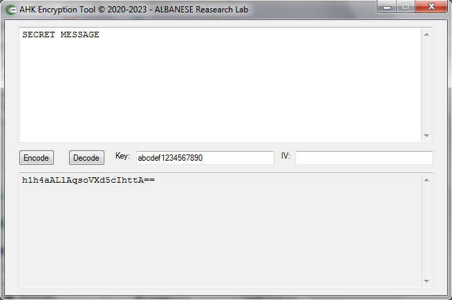

# AHK Encryption Tool
[](https://github.com/pedroalbanese/cryptgui/blob/master/LICENSE.md) 
[](https://github.com/pedroalbanese/cryptgui/releases)
[](https://github.com/pedroalbanese/cryptgui/releases)

#### AES-CBC String Encryption Tool written in Pure AutoHotKey

The Advanced Encryption Standard (AES), also known by its original name Rijndael, is a specification for the encryption of electronic data established by the U.S. National Institute of Standards and Technology (NIST) in 2001.




### PHP Equivalent
```php
Result Decrypted:
<?php
	$iv = "0000000000000000";
	$pass = "abcdef1234567890";
	$method = 'aes-128-cbc';

	print (openssl_decrypt("GpYTwZzU+Rio2VT09NhIug==", $method, $pass, false, $iv));
?>

Result Encrypted:
<?php
	$iv = "0000000000000000";
	$pass = "abcdef1234567890";
	$method = 'aes-128-cbc';

	print (openssl_encrypt("SECRET MESSAGE", $method, $pass, false, $iv));
?>
```

## License

This project is licensed under the ISC License.

#### Copyright (c) 2020-2023 Pedro F. Albanese - ALBANESE Research Lab.
